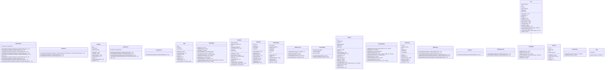

# My Project

## System Architecture

```mermaid
classDiagram
direction BT
class AdminServlet {
  - UserServices userServices
  - handleAddProduct(HttpServletRequest, HttpServletResponse) void
  # doPost(HttpServletRequest, HttpServletResponse) void
  - handleEditUser(HttpServletRequest, HttpServletResponse) void
  - handleEditProduct(HttpServletRequest, HttpServletResponse) void
  - handleDeleteProduct(HttpServletRequest, HttpServletResponse) void
  + init() void
  - handleDeleteUser(HttpServletRequest, HttpServletResponse) void
  # doGet(HttpServletRequest, HttpServletResponse) void
  - handleAddUser(HttpServletRequest, HttpServletResponse) void
  - handleUpdateOrderStatus(HttpServletRequest, HttpServletResponse) void
}
class CartServlet {
  - handlePlaceOrder(HttpServletRequest, HttpServletResponse, HttpSession, List~Map~String, String~~) void
  # doPost(HttpServletRequest, HttpServletResponse) void
  # doGet(HttpServletRequest, HttpServletResponse) void
}
class Category {
  - int id
  - String name
  - String description
  + getName() String
  + toString() String
  + getDescription() String
  + setName(String) void
  + getId() int
  + setDescription(String) void
  + setId(int) void
}
class LoginServlet {
  - UserServices userServices
  # doGet(HttpServletRequest, HttpServletResponse) void
  # doPost(HttpServletRequest, HttpServletResponse) void
  - handleLogin(HttpServletRequest, HttpServletResponse) void
  - handleRegistration(HttpServletRequest, HttpServletResponse) void
  + init() void
}
class LogoutServlet {
  # doGet(HttpServletRequest, HttpServletResponse) void
}
class Order {
  - int id
  - int userId
  - String status
  + getStatus() String
  + setStatus(String) void
  + toString() String
  + getId() int
  + getUserId() int
  + setId(int) void
  + setUserId(int) void
  + createOrder(int, int, String) Order
}
class OrderDbImp {
  + findById(int) Order?
  + deleteOrder(int) boolean
  + insert(Order) boolean
  - getOrderItems(int) List~OrderItemInfo~
  + insertOrder(Connection, int, double) int
  + getLowStockProducts() List~ProductInfo~
  + updateProductStock(int, int) boolean
  + getAllOrders() List~OrderInfo~
  + insertOrderItem(int, int, double) void
  + updateProductBasicInfo(int, String, String, double, int) boolean
  + updateOrderStatus(int, String) boolean
}
class OrderInfo {
  - String userEmail
  - BigDecimal totalAmount
  - int id
  - Timestamp orderDate
  - List~OrderItemInfo~ items
  - int userId
  - String status
  + getStatus() String
  + getUserEmail() String
  + getItems() List~OrderItemInfo~
  + getUserId() int
  + setStatus(String) void
  + getId() int
  + getOrderDate() Timestamp
  + setItems(List~OrderItemInfo~) void
  + getTotalAmount() BigDecimal
}
class OrderItem {
  - int orderId
  - double price
  - int productId
  - int quantity
  + setProductId(int) void
  + getOrderId() int
  + getProductId() int
  + setPrice(double) void
  + toString() String
  + setOrderId(int) void
  + getPrice() double
  + getQuantity() int
  + setQuantity(int) void
}
class OrderItemInfo {
  - int productId
  - String productName
  - double price
  - int quantity
  - int orderId
  - int id
  + getQuantity() int
  + getId() int
  + getProductName() String
  + getOrderId() int
  + getProductId() int
  + getPrice() double
}
class OrderServices {
  + insertOrder(Connection, int, double) int
  + updateProductStock(int) void
  + isProductInStock(int) boolean
  + placeOrder(ProductInfo, int) OrderInfo
  + insertOrderItem(int, int, double) void
}
class PasswordUtil {
  - SecureRandom RAND
  - String DELIMITER
  - int SALT_BYTES
  + generateSaltedHash(String) String
  + verifyPassword(String, String) boolean
}
class Product {
  - int id
  - int categoryId
  - int stock
  - String description
  - String name
  - double price
  + toString() String
  + getId() int
  + setName(String) void
  + setDescription(String) void
  + setStock(int) void
  + getStock() int
  + getCategoryId() int
  + getPrice() double
  + getName() String
  + setCategoryId(int) void
  + createProduct(int, String, String, double, int, int) Product
  + getDescription() String
  + setId(int) void
  + setPrice(double) void
}
class ProductDbImp {
  + updateProduct(int, String, String, double, int, int) boolean
  + findById(int) ProductInfo?
  + getAllProducts() List~ProductInfo~
  + updateProductStock(int) void
  + updateProductBasicInfo(int, String, String, double, int) boolean
  + getLowStockProducts() List~ProductInfo~
  + deleteProduct(int) boolean
  + updateProductStock(int, int) boolean
  + isProductInStock(int) boolean
  + addProduct(String, String, double, int, int) boolean
}
class ProductInfo {
  - int stock
  - String description
  - int id
  - double price
  - String name
  - int categoryId
  + getId() int
  + getStock() int
  + getDescription() String
  + getPrice() double
  + getCategoryId() int
  + getName() String
}
class StaffServlet {
  # doGet(HttpServletRequest, HttpServletResponse) void
  # doPost(HttpServletRequest, HttpServletResponse) void
  - handleUpdateOrderStatus(HttpServletRequest, HttpServletResponse) void
  - handleUpdateProductStock(HttpServletRequest, HttpServletResponse) void
  - handleUpdateProduct(HttpServletRequest, HttpServletResponse) void
}
class TestFetch {
  # doGet(HttpServletRequest, HttpServletResponse) void
}
class TestPageServlet {
  # doPost(HttpServletRequest, HttpServletResponse) void
  # doGet(HttpServletRequest, HttpServletResponse) void
}
class User {
  - String password
  - int id
  - int roleId
  - String username
  - String email
  - String token
  + setRoleId(int) void
  + getRoleId() int
  + getId() int
  + setId(int) void
  + getToken() String
  + getPassword() String
  + getUsername() String
  + setEmail(String) void
  + getEmail() String
  + setPassword(String) void
  + searchUser(String, String, String) Collection
  + setUsername(String) void
  + createUser(int, String, String, String, int) User
  + toString() String
}
class UserDbImp {
  + findByEmail(String) User?
  + getAllUsers() List~User~
  + updateUserRole(int, int) boolean
  + searchUser(String, String, String, String) Collection?
  + deleteUser(int) boolean
  + insert(User) boolean
}
class UserInfo {
  - int role
  - String email
  - int id
  - String username
  + getEmail() String
  + getUsername() String
  + getId() int
  + getRole() int
}
class UserServices {
  + register(String, String, String, int) UserInfo
  + login(String, String) UserInfo
}
class supa {
  - String URL
  + getConnection() Connection
}

UserDbImp  -->  User
```
